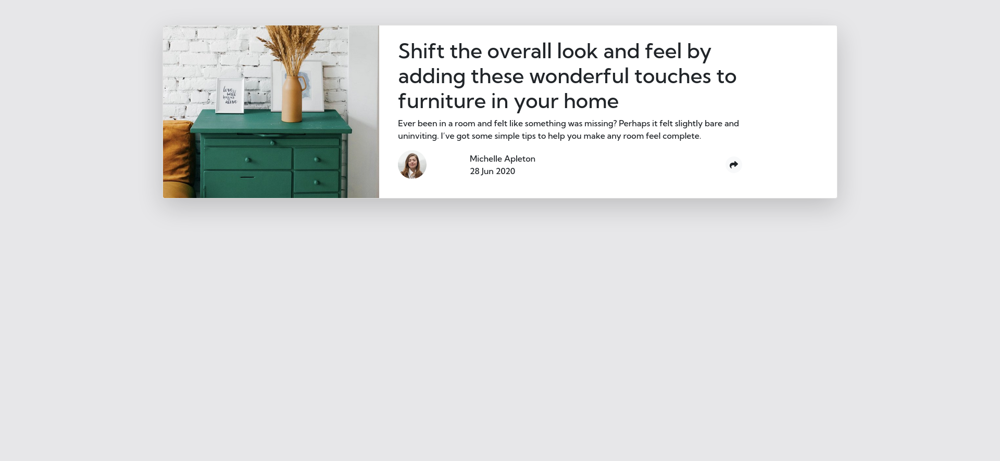
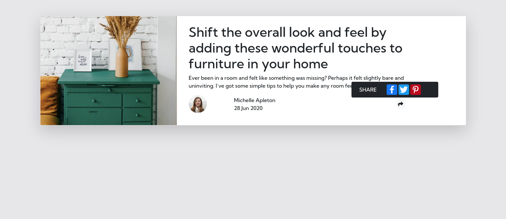
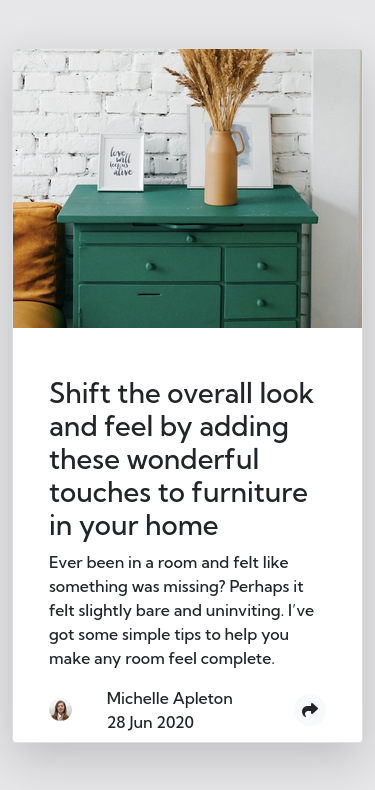
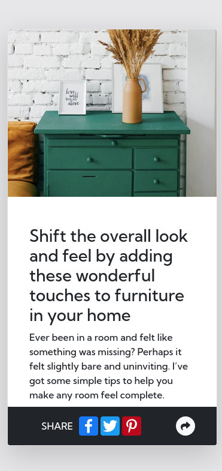

# Frontend Mentor - Article preview component solution

This is a solution to the [Article preview component challenge on Frontend Mentor](https://www.frontendmentor.io/challenges/article-preview-component-dYBN_pYFT).

## Table of contents

- [Overview](#overview)
  - [The challenge](#the-challenge)
  - [Screenshot](#screenshot)
  - [Links](#links)
- [My process](#my-process)
  - [Built with](#built-with)
  - [What I learned](#what-i-learned)
  - [Continued development](#continued-development)
  - [Useful resources](#useful-resources)
  
## Overview

### The challenge

Users should be able to:

- View the optimal layout for the component depending on their device's screen size
- See the social media share links when they click the share icon

### Screenshot

### Links

- [Live Site URL](https://teobidzishvili.github.io/article-preview-component/)

## My process

### Built with

- Semantic HTML5 markup
- CSS custom properties
- Bootstrap
- Mobile-first workflow
- Javascript

### What I learned

Share buttons' options from differenc sources. Before using , I tried , that did not work well. Particularly, when loaded page buttons did not appear, only after resizing the viewport it was shown. I think there is bug.

### Continued development

I would try other sources for share buttons, to make my project design more similar to the challenge design. I will try to define what was the reason not showing buttons, while using "ShareThis" code.

### Useful resources

- [Resource 1](https://www.addtoany.com/buttons/) - This helped me to add share buttons very easy, that automaticaly allows you to share link on social media.

